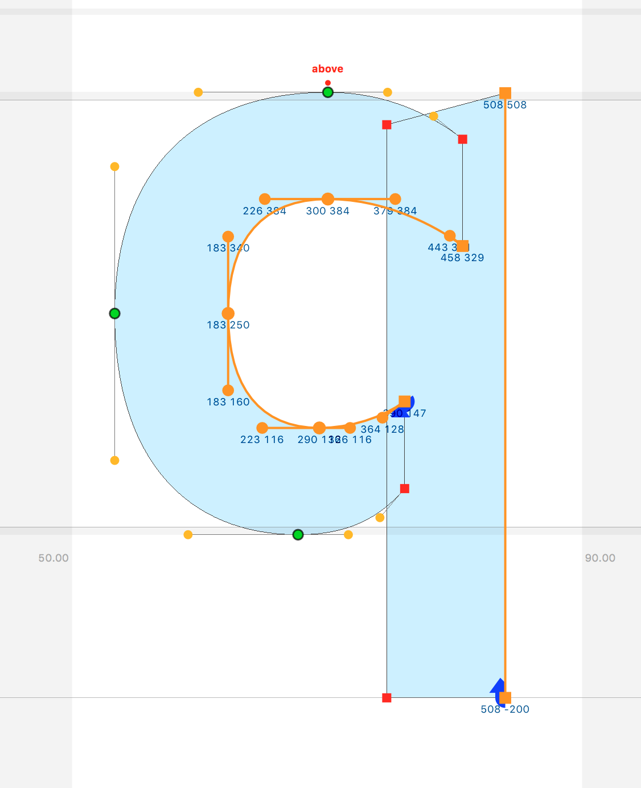

# GlyphMorf

GlyphMorf is an experimental way for making parametric adjustments for a font, in RoboFont.

GlyphMorf can do **a lot** of work for you, but your fonts still need your professional type designers attention. 

Thom Janssen 2017

## License

Downloading GlyphMorf Extension is free. Using GlyphMorf is a professional environment is not. Please [visit my website and make a choice.](http://hallotype.nl/support/)

## Requirements 

- RoboFont 
- DrawBot Extension
- This Extension :)

## How

GlyphMorf analyses the glyph drawing and extract parameters out of it. By redrawing the glyph with different parameters you get different new glyphs / fonts. 

## Drawing conventions for GlyphMorf

The drawing should be so that every point on the contour can be paired with an other point in the same contour on the other side of the stem/stroke. This means that all contours must have an even number of points. The starting point marks the beginning of the inner or outer part of the contour, depends a bit on the design. See image, the selected (orange) segments show the first half of the contours. 

## Recipes

Recipes are the way to store different transformations in the font and glyphs. The font known the names of recipes and the default values of the parameters. A glyph can have a own set of parameters for a recipe but this is optional. 

## GlyphMorf content

#### ▶️ The Observer

The main tools is the observer which shows how the glyph transforms. 

**Recipes**:

- 🌟 new recipes
- ⛔️ del recipe

**Parameters**:

- 🔹 set default
- ⚡️ put default
- ▪️ set private glyph parameters
- ▫️ del private glyph parameters

**DesignSpace**:

- make DesignSpaceDocument with all recipes, also all the necessary source fonts for the design space will be generated. [for now in `~/Desktop/morf/`]

**Get Font**:

- Generate/open the current recipe.

## Coming up

#### 🔜 MakeFont

Small dialog with simple purpose: choose a recipe and some additional options and make a font/ufo.

#### 🔜 MorfSpaceCenter

A SpaceCenter where you see the morfed glyphs in action. Choose a recipe or pull some sliders. Also here it is possible to make recipes and, get and set values to parameters.

#### 🔜 MorfGlyphsInterpolationAnimation

A DrawBot script with an extra dialog. It loads the recipes of the font, you can set some new ones too. order the recipes you want and set the frame duration and how many frames per interpolation from one recipe to the next. Set them colours! Gif animation.

## TODO

- also RF2
- better support for diagonals
- make it all smarter so that drawing conventions are less important
- some sort of linked relation between contours (this pt of this c is always at this relative/absolute position of that pt of that c) (skill level 💯)
- spacing?

## To be clear

As said earlier this tools is not an all-in-one magic thing. Results depends on your drawings and what you do with GlyphMorf. 

GlyphMorf is not:

- magic
- solution to all you type design problems

GlypMorf is:

- math
